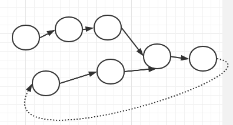
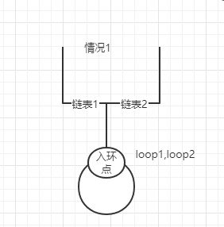
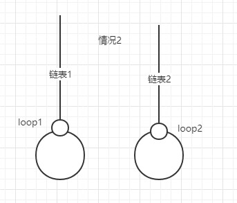
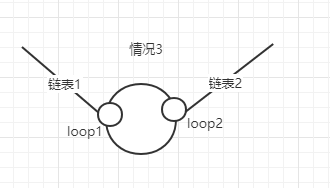
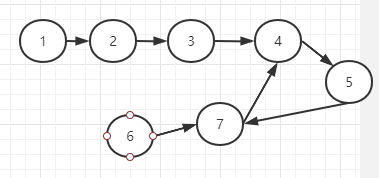

## 两个单链表的相交问题

下面将会在**时间复杂度为O(N+M)**和不使用额外的空间，则**空间复杂度为O(1)**的情况下解决：

- 两个直链表是否相交、有则求相交节点
- 两个有环的链表是否相交（详解），有则求相交点
- 一个直链表和一个有环链表（不存在这种情况的相交，后面详解）

#### 一、两直链表相交问题

​	**暴力循环**，时间复杂度O(len1*len2)，空间复杂度O(1)，没遍历一个节点，就遍历另一链表，如果有节点相同（地址相同，地址相同节点的value也相同），则两直链表相交，相同节点就为相交节点。由于时间复杂度过大，不符合我们的要求。

运用**栈**，空间复杂度O(len1)或O(len2)，把两个直链表分别压入两个栈，栈顶节点相同则相交，后双栈依次出栈，最后一个相同节点为相交节点。空间复杂度不符合我们的要求。

运用**hash/set集合**，时间复杂度O(len1+len2)，空间复杂度O(len1)或O(len2)，把一直链表全部加入集合，遍历另一直链表，判断集合是否存在相同的节点地址，存在则相交，且该节点为相交节点。空间复杂度不符合我们的要求。

**分析**相交的直链表相交则最后一个节点相同，难点是怎么寻找相交节点？我们可以在遍历直链表的最后的节点时记录链表长度，后长的链表先移动两个链表长度的差值，再两链表同时遍历，直到遍历两链表的节点相同则为相交节点。符合我们的要求。呈上代码。

```java
/**
 * 直链表，相交返回相交节点   单词loop：环
 *
 * @param head1 链表1
 * @param head2 链表2
 * @return
 */
public Node noLoop(Node head1, Node head2) {
    if (head1 == null || head2 == null) return null;
    Node cur1 = head1;
    Node cur2 = head2;
    int n = 0;//记录链表的长度
    while (cur1.next != null) {
        n++;
        cur1 = cur1.next;
    }
    while (cur2.next != null) {
        n--;  // n最后为两链表得长度差
        cur2 = cur2.next;
    }
    if (cur1 != cur2) {  //两链表终点相同则表明有焦点
        return null;
    }

    //相交
    cur1 = n > 0 ? head1 : head2;//cur1记录长的链表   //合理利用三目元算符更可口哦！！！
    cur2 = cur1 == head1 ? head2 : head1;//cur2记录短链表
    // n = Math.abs(n);
    n = n > 0 ? n : -(n);
    //长的链表走到和短链表一样的长度
    while (n != 0) {
        n--;
        cur1 = cur1.next;
    }
    while (cur1 != cur2) {
        cur1 = cur1.next;
        cur2 = cur2.next;
    }
    return cur1;
}
```

还有另一思路，上图



就是遍历完一条直链表时，把最后节点的next指针指向另一链表的头，再遍历，如果遍历过程有节点和前链表的节点相同，则相交且节点就在第一个相同地址的节点，思路很是挺简单的，上面代码的思路感觉较好理解和容易编码。这个思路代码就不送上啦，哈哈哈！！！

#### 二、两成环链表相交问题

两链表成环共有3种情况：







解决两成环链表**事先需要判断链表是否有环**。判断单链表是否有环和入环点在哪里，这些都是基本操作。这里不再累述，快慢指针送上。

```java
/**
 * 单链表有环则返回入环节点,快慢指针
 * @param head
 * @return
 */
public Node getLoopNode(Node head) {
    if (head == null || head.next == null || head.next.next == null) {
        return null;
    }
    Node slow = head.next;
    Node fast = head.next.next;
    //如果有环则最终会相等；如果节点为null则表明不成环
    while (slow != fast) {
        if (fast.next == null || fast.next.next == null) {
            return null;
        }
         fast = fast.next.next;
        slow= slow.next;
    }
    fast = head;
    //这里快慢指针求换的入环点，原理在网上一大堆，不再累述
    while (fast != slow) {
        fast=fast.next;
        slow=slow.next;
    }
    return slow;
}
```

分析情况1，我们已知两链表有环且链表1入环点loop1，链表2入环点loop2且loop1==loop2。可以采取类似上面两直链表相交问题代码的方法，区别是上面是以null为终点，这里是以loop1、loop2为终点。

情况2、3，loop1！=loop2，怎么判断是情况2还是情况3呢？可以在环内的loop1节点开始遍历，如果再次遍历到loop1节点时没有经过loop2则为情况2，否则为情况3。大概思路看代码就清晰了。

```java
/**
 * 两个有环的链表是否相交（详解），有则返回相交点
 * 有环有3种情况
 */
/**
 * @param head1 链表1
 * @param loop1 链表1的入环节点
 * @param head2 链表2
 * @param loop2 链表2的入环节点
 * @return
 */
public Node bothLoop(Node head1, Node loop1, Node head2, Node loop2) {
    Node cur1 = null;
    Node cur2 = null;
    //情况1
    if (loop1 == loop2) {
        cur1 = head1;
        cur2 = head2;
        int n = 0;
        while (cur1 != loop1) {
            n++;
            cur1 = cur1.next;
        }
        while (cur2 != loop2) {
            n--;
            cur2 = cur2.next;
        }
        cur1 = n > 0 ? head1 : head2;
        cur2 = cur1 == head1 ? head2 : head1;
        n = Math.abs(n);
        while (n != 0) {
            n--;
            cur1 = cur1.next;
        }
        while (cur1 != cur2) {
            cur1 = cur1.next;
            cur2 = cur2.next;
        }
        return cur1;
    } else {
        //情况2、3
        cur1 = loop1.next;
        while (cur1 != loop1) {  //情况2的cur1会等于loop1；情况3则是在cur1等于loop1前会和loop2相等
            if (cur1 == loop2) {
                return loop1;
            }
            cur1 = cur1.next;
        }
        return null;
    }

}
```

把全部的情况整合一下。



```java
/**
 * 主方法
 *
 * @return
 */
public Node getIntersectNode(Node head1, Node head2) {
    if (head1==null||head2==null) return null;
    Node loop1 = getLoopNode(head1);//获取链表的入环节点
    Node loop2 = getLoopNode(head2);
    if (loop1 == null && loop2 == null) { //两链表为直链表
        return noLoop(head1, head2);
    }
    if (loop1 != null && loop2 != null) {
        return bothLoop(head1, loop1, head2, loop2);  //两链表为环链表
    }
    return null;
}

public static void main(String[] args) {
    //1->2->3->4->5->7  6->7->4
    Node node1 = new Node(1);
    Node node2 = new Node(2);
    Node node3 = new Node(3);
    Node node4 = new Node(4);
    Node node5 = new Node(5);
    Node node6 = new Node(6);
    Node node7 = new Node(7);
    node1.next=node2;
    node2.next=node3;
    node3.next=node4;
    node4.next=node5;
    node5.next=node7;
    node6.next=node7;
    node7.next=node4;
    Node head1 = node1;
    Node head2 = node6;
    LinkIntersect linkIntersect = new LinkIntersect();
    Node node = linkIntersect.getIntersectNode(head1, head2);
    System.out.println(node.val);
}
```

代码集合地：https://github.com/ZH-L-Jie/Note